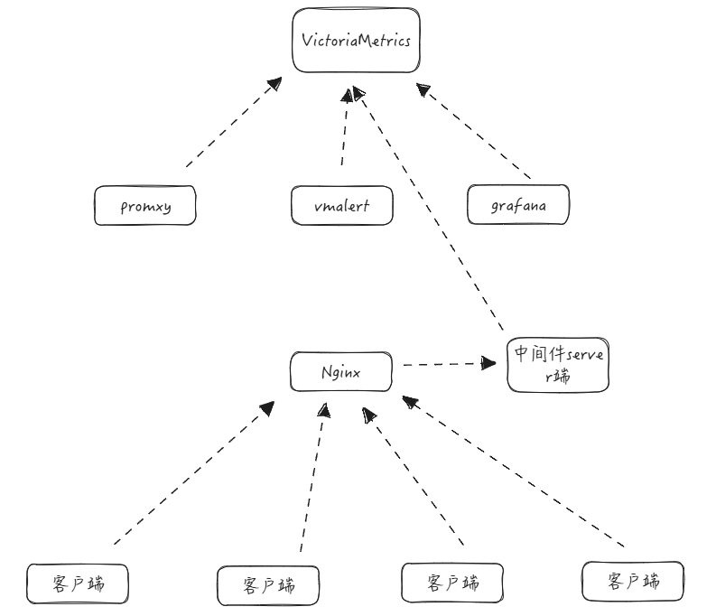

## 简介

> 本架构基于VictoriaMetrics的推送模式实现，VictoriaMetrics部署于K8S集群中，可以用于监控集群基础信息，使用Python模仿vmagent将多个局域网的node_exaple的主机信息推送到VictoriaMetrics用于监控与告警。

## 基础组件地址

| 组件            | 环境 | 地址                                                     | 说明 |
| --------------- | ---- | -------------------------------------------------------- | ---- |
| VictoriaMetrics | K8S  | http://192.168.1.227:31689                               |      |
| promxy          | K8S  | http://192.168.1.227:31139                               |      |
| vmalert         | K8S  | http://192.168.1.227:32684                               |      |
| grafana         | K8S  | http://192.168.1.227:31868                               |      |
| server端        | 主机 | http://192.168.1.160:5000<br />http://192.168.1.160:5001 |      |
| nginx           | 主机 | http://192.168.1.225:31037                               |      |

## 系统架构

```plaintext
客户端 (Client) → 服务端 (Server) → VictoriaMetrics → Grafana
     ↓                ↓                ↓
  指标收集         数据存储/转发
  主机注册         状态监控       →  vmalert
                  Web界面           告警
```



## 组件部署

## 服务端部署

```bash
python server.py

# 暴露5000和5001端口
# 其中5001数据上报接口，需要通过nginx暴露给agent客户端
```

## Nginx代理测试

> 正常情况下此代理需要配置域名+证书并开放到公网

```bash
[root@llody-dev ~]#cat /etc/nginx/conf.d/vm.conf 
server {
    listen  31037;
    server_name _;
    client_max_body_size 1000m;
    #ssl_certificate /etc/nginx/llody.com/llody.com.pem;
    #ssl_certificate_key /etc/nginx/llody.com/llody.com.key;
    #ssl_prefer_server_ciphers on;
  

    location / {
        # 检查是否提供了有效的令牌
        #if ($http_x_auth_token != "t7HXW3jVgfD74VDw=") {
        #    return 403;
        #}
        proxy_set_header  Host $host;
        proxy_set_header  X-Real-IP  $remote_addr;
        proxy_set_header  X-Forwarded-For $proxy_add_x_forwarded_for;
        proxy_set_header X-Forwarded-Proto  $scheme;
        proxy_pass http://192.168.1.227:31689;
        #proxy_pass http://192.168.1.160:5001;

        proxy_connect_timeout 60;
        proxy_read_timeout 1314;
        proxy_send_timeout 1314;

        proxy_redirect http:// $scheme://;
        port_in_redirect off;
        proxy_buffering off;
  
    }

  location /healthz {
    return 200;
  }
}
```

## 客户端部署

### 修改配置

```yaml
# cat config.yaml
# VictoriaMetrics 的上报地址
#victoria_metrics_url: "http://192.168.1.160:5001/report"
victoria_metrics_url: "http://192.168.1.225:31037/report"

# 任务名称，用于标识监控任务
job_name: "system_monitoring"

# 数据上报间隔（单位：秒）
report_interval: 5

# 抓取目标配置，类似于 vmagent 的 scrape_configs
scrape_configs:
  - job_name: "node_exporter"
    static_configs:
      - targets: ["192.168.1.217:9100","192.168.1.218:9100"]
  - job_name: "cadvisor"
    static_configs:
      - targets: ["192.168.1.217:8386","192.168.1.218:8386"]

# 可选：认证令牌
auth_token: "t7HXW3jVgfD74VDw="

# 项目名称
project: "system_monitor"
labels:
  project: "system_monitor"  # 必须与 project 字段一致
  account: "部门"
  env: "dev"
  region: "cd-1"
```

### 启动客户端示例

```bash
# python3 client.py 
2025-08-01 16:03:57 - INFO - 成功获取公网IP: 
2025-08-01 16:03:57 - INFO - 主机信息: {'system': 'Linux', 'release': '3.10.0-1160.90.1.el7.x86_64', 'version': '#1 SMP Thu May 4 15:21:22 UTC 2023', 'machine': 'x86_64', 'processor': 'x86_64', 'python_version': '3.9.10', 'cpu_count': 2, 'memory_total': 3.7002029418945312, 'disk_total': 106.04730606079102, 'boot_time': '2025-07-29T22:40:19'}
```
